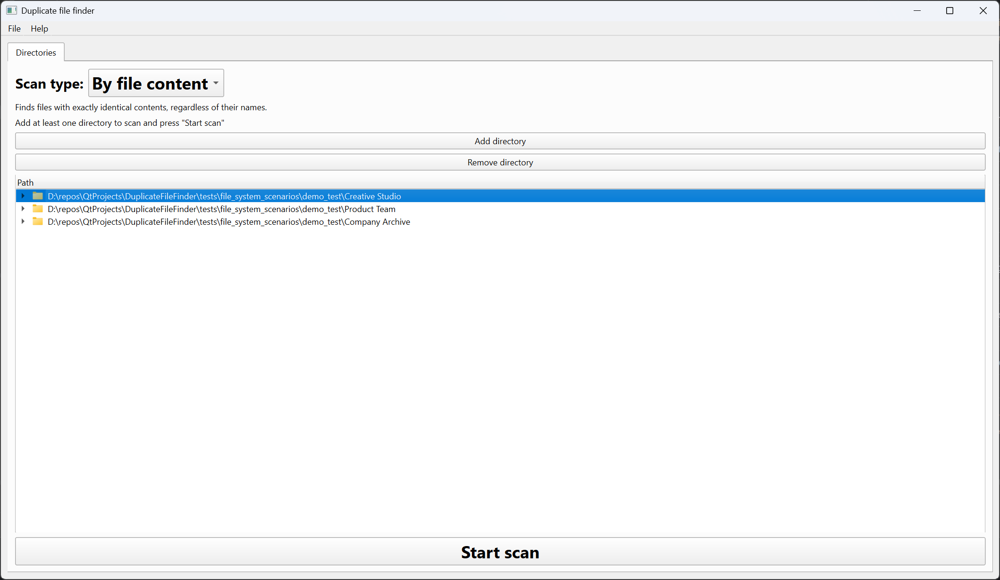
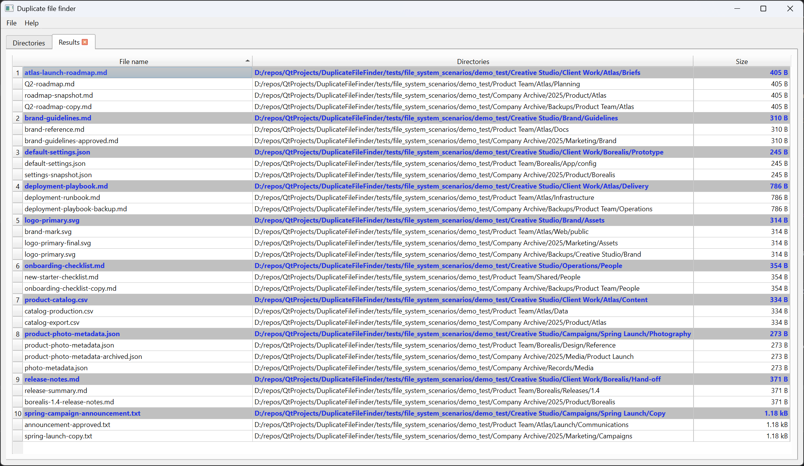

# Duplicate File Finder

A fast, minimalistic, read-only duplicate file finder written in C++20 using Qt 6.9.2 Widgets.

The application recursively scans one or more directory trees and finds duplicated files either by identical contents or by
matching names. It does not delete, move, or modify scanned files; it presents the results so they can be inspected
and handled deliberately.

## Features

- scan multiple directory roots in one operation
- find files with exactly identical contents, regardless of their names
- find files with matching names, ignoring letter case and the final file extension
- monitor scan phases and file counts in a cancellable progress dialog
- keep the interface responsive by running scans outside the GUI thread
- browse selected directory trees without exposing them to modification
- sort duplicate groups by file name, directory, or size
- reveal a result in the system file manager or copy its path
- export duplicate groups to a standalone HTML report
- log scan summaries and files that could not be read

## Screenshots

### Directories



### Results



The screenshots use a deterministic artificial filesystem included in the test data.

## Scan modes

### By file content

This is the default mode. A file is reported as a duplicate only after its contents have been compared byte for
byte. File names and extensions do not affect the result.

The scan reduces the amount of disk I/O in stages:

1. Files are collected and grouped by size. A file with a unique size cannot have an identical copy and is not read
   again.
2. Files that share a size are grouped using SHA-256. Hash groups containing only one file are discarded.
3. Files that share both size and hash are compared byte for byte. Hashes are treated only as candidate filters, not
   as proof that two files are identical.

#### Large-file optimization

Fully hashing several unrelated multi-gigabyte files merely because they have the same size is expensive. For files
of at least 64 MiB, the application first calculates SHA-256 for a 1 MiB prefix:

- a unique prefix hash proves that the file differs from every other file in its equal-size group, so full hashing is
  skipped
- files with matching prefix hashes continue through full-file hashing and exact byte comparison

The sample therefore only removes impossible candidates. It cannot make two files count as duplicates, and matching
samples never bypass the correctness checks used by the normal workflow.

### By file name

This mode groups files by name without reading their contents. Comparison is case-insensitive and ignores only the
final extension, so files such as `report.txt`, `REPORT.pdf`, and `report` belong to the same result group. Their
contents may differ.

## Performance-related design

- repeated and nested scan roots are consolidated so the same directory tree is not scanned more than once
- size and hash groups use in-memory hash tables, progressively reducing the set of files that require further I/O
- hashing and exact comparison stream files through 1 MiB buffers instead of loading complete files into memory
- cancellation is checked while files are enumerated, hashed, and compared
- directory children are loaded on demand when a tree node is expanded
- the results view uses a dedicated table model and fixed row heights to remain responsive with large result sets

The scan itself runs as one background workflow. The current performance comes primarily from avoiding unnecessary
file reads rather than from hashing many files in parallel.

## Result safety

Duplicate File Finder is intentionally read-only. It provides duplicates discovery and navigation tools, but no automatic file
removal. Unreadable files are skipped, recorded in the log, and reported to the user because the resulting scan may
be incomplete.

## Tests

Tested using Google Test 1.17.0. The test suites cover the scan workflows, cancellation and failure paths, progress
reporting, hash-collision handling, large-file sampling, HTML export, asynchronous application integration, and Qt
item models. Deterministic filesystem scenarios are included for end-to-end scan tests.

## How to build

Requirements:

- CMake 3.16 or newer
- C++20 compiler
- Qt 6.9.2 with the Widgets and Concurrent components


```shell
cmake -S . -B build -DBUILD_TESTING=ON
cmake --build build --config Release
```

Configure Qt through `CMAKE_PREFIX_PATH` if it is not already discoverable by CMake. For example:
```
cmake -S . -B build -DBUILD_TESTING=ON -DCMAKE_PREFIX_PATH="C:/Qt/6.9.2/msvc2022_64"
```

The executable is written int the `bin` directory. The exact configuration subdirectory depends on the selected
CMake generator.

Run all tests with:

```shell
ctest --test-dir build -C Release --output-on-failure
```
